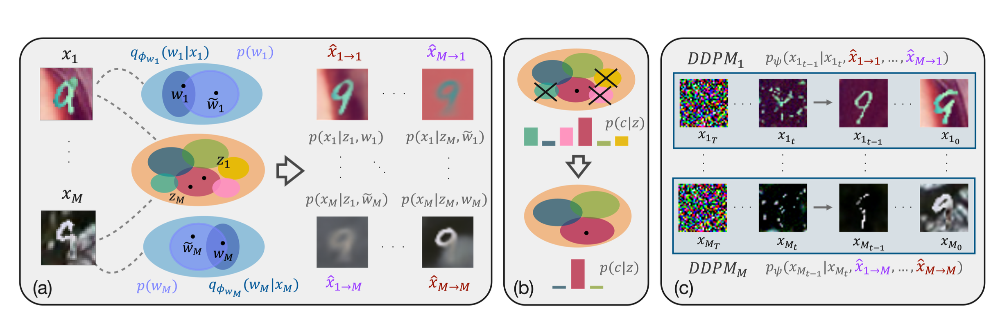
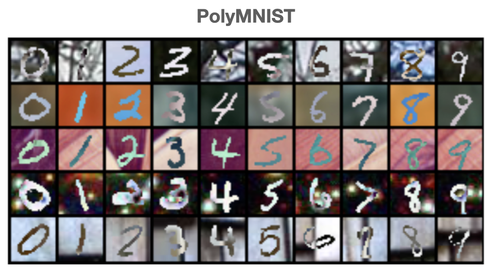
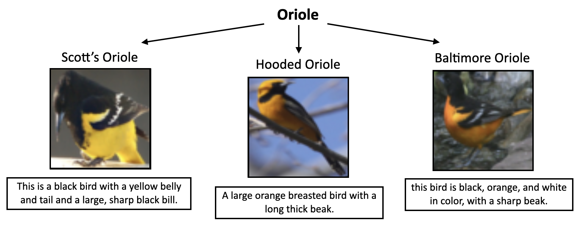
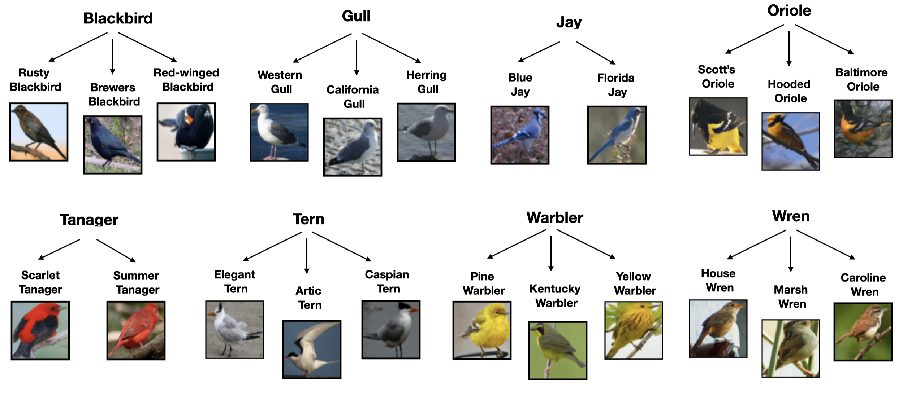

# Deep Generative Clustering with Multimodal Diffusion Variational Autoencoders 

This is the original PyTorch implementation of the paper [_Deep Generative Clustering with Multimodal Diffusion Variational Autoencoders._](https://openreview.net/pdf?id=k5THrhXDV3) presented as poster at ICLR 2024. 


## Datasets 
### PolyMNIST 


To download the PolyMNIST dataset run
```
mkdir data 
cd data 
curl -L -o data_PM_ICLR_2024.zip https://polybox.ethz.ch/index.php/s/DvIsHiopIoPnKXI/download
unzip data_PM_ICLR_2024.zip
mv data_PM_ICLR_2024/* ./
```

### CUBICC
We introduce a variation of the CUB Image-Captions dataset [1], based on the Caltech-UCSD Birds
(CUB) dataset. 
To do so, we group sub-species of birds in the original dataset in eight single species.
As a result we obtain a challenging realistic multimodal 
clustering dataset. Below is an example for three datapoints (each corresponding to a different sub-species) that are grouped under the same species.



The CUBICC dataset consists of 13150 image-captions paired samples from 22 subspecies, grouped into 8 species: 

**Blackbird, Gull, Jay, Oriole, Tanager, Tern, Warbler, Wren**.



To download the CUBICC dataset run
```
mkdir data 
cd data 
curl -L -o CUBICC.zip https://polybox.ethz.ch/index.php/s/LRkTC2oa6YHHlUj/download
unzip CUBICC.zip
```
## Experiments 
Run on PolyMNIST dataset
```
bash commands/run_polyMNIST_experiment.sh
```

Run on CUBICC dataset
```
bash commands/run_CUBICC_experiment.sh
```
( NOTE: To run the CUBICC experiment, you will also need the polymnist dataset downlaoded )

## Citing 
```
@inproceedings{
palumbo2024deep,
title={Deep Generative Clustering with Multimodal Diffusion Variational Autoencoders},
author={Emanuele Palumbo and Laura Manduchi and Sonia Laguna and Daphn{\'e} Chopard and Julia E Vogt},
booktitle={International Conference on Learning Representations },
year={2024},
}
```

#### Acknowledgements
Codebase based on the [MMVAE+](https://github.com/epalu/mmvaeplus) repo.

